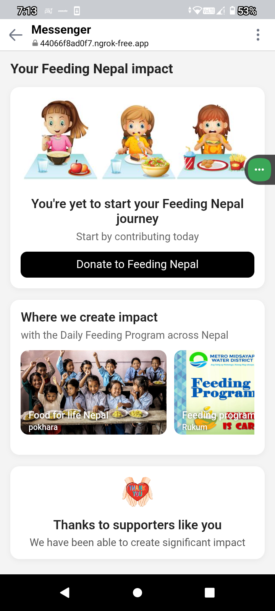

Dmeal - Food Ordering and Delivery App 

 About the Project 

This is my first personal full-stack web project, developed completely by myself — from backend to frontend. The app is inspired by modern food delivery platforms and is designed to make ordering food online easy, responsive, and impactful. 

Dmeal doesn’t just stop at food delivery; it introduces a unique donation feature to help underprivileged communities access meals through food donations. My aim is to blend convenience with compassion. 

 

 Technologies Used 

 Frontend: 

    HTML, CSS, JavaScript 

    Bootstrap (for responsive and mobile-first design) 

Backend: 

    Python with Django Framework 

    SQLite database (for development and local data storage) 

 Development Tools: 

    Django’s built-in development server 

    Ngrok (for local testing on real devices via tunnel) 

 

 Responsiveness 

The app is fully mobile responsive, ensuring smooth usability across desktops, tablets, and smartphones. 

 

 Key Features 

     User Registration and Login System 

    Dynamic Menu: Choose one or multiple food items and add to cart 

     Multiple Restaurant Partners: Select food items from different restaurants 

     Interactive Cart: Increase/decrease item quantities, live total price update 

     Geolocation Support: 

    Auto-detect address if the browser supports geolocation 

    Manual address entry fallback 

     Order Notifications 

     Email Confirmation after a successful order 

     Food Donation Feature: 

    Donate meals to people in need 

    Donor names are stored and honored in the database 

    Feedback System: 

    Review food and app experience 

    Helps improve service quality 

 

 User Flow 

    Visit the main landing page (user/admin options available) 

    Navigate to the user side to start browsing 

    Go to the Menu to select food items 

    Explore different restaurant partners and add items to cart 

    View Cart Page: 

    Modify quantities 

    See automatic price updates 

    Provide address (geolocation/manual) 

    Confirm order 

    Receive email notification after a successful order 

 

Screenshots 
## 📸 Screenshots

<table>
  <tr>
    <td></td>
    <td></td>
  </tr>
  <tr>
    <td align="center">Screenshot 1</td>
    <td align="center">Screenshot 2</td>
  </tr>
  <tr>
    <td></td>
    <td></td>
  </tr>
  <tr>
    <td align="center">Screenshot 3</td>
    <td align="center">Screenshot 4</td>
  </tr>
  <tr>
    <td></td>
    <td></td>
  </tr>
  <tr>
    <td align="center">Screenshot 5</td>
    <td align="center">Screenshot 6</td>
  </tr>
  <tr>
    <td colspan="2" align="center"></td>
  </tr>
  <tr>
    <td colspan="2" align="center">Screenshot 7</td>
  </tr>
</table>

---

## 🫱 How to Donate

<table>
  <tr>
    <td></td>
    <td></td>
  </tr>
  <tr>
    <td align="center">Donation Step 1</td>
    <td align="center">Donation Step 2</td>
  </tr>
  <tr>
    <td></td>
    <td></td>
  </tr>
  <tr>
    <td align="center">Donation Step 3</td>
    <td align="center">Donation Step 4</td>
  </tr>
</table>

 Deployment 

    Local testing via Ngrok: Easily accessible from any device with internet access without full public deployment. 

    Provides real-time feedback and device testing across networks. 

Project Vision/Conclusion 

My main goal with this project is to provide better food delivery services at an affordable cost. I also have a bigger dream — to one day build a network of restaurants around the world, all connected through this app, so people can easily order food no matter where they are. 

But beyond convenience, this app has a deeper purpose. I added a food donation feature to help those who are in difficult situations and cannot afford food. Users can donate meals, and their contributions are recorded in the system with appreciation. 

In the future, I hope to organize food donation programs in every community — monthly or yearly — to support people who truly need help. This project is not just about technology; it’s about kindness, compassion, and humanity. 

I believe that everyone has the right to food. Unfortunately, not everyone has the means. That’s why I want this app to become a bridge — connecting those who can help with those who need it. Together, we can make a real difference. 

 "Let’s build a future where no one sleeps hungry — because sharing food is sharing love." 

 